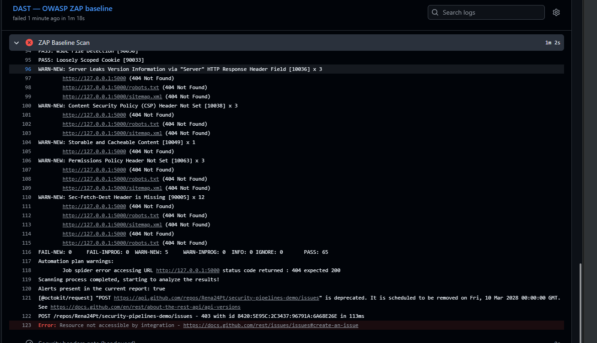
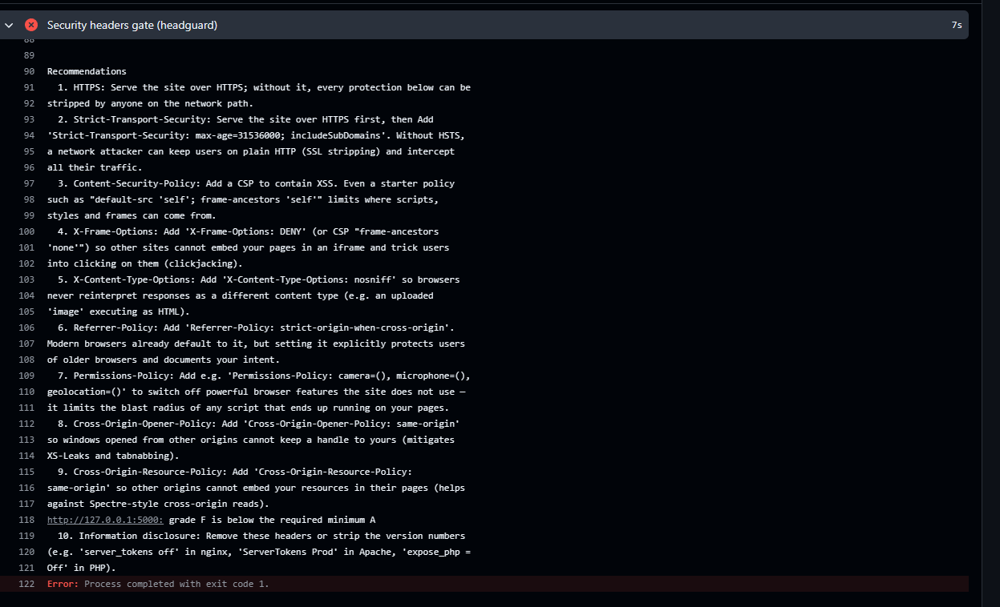
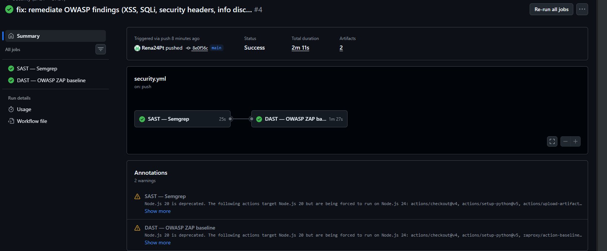
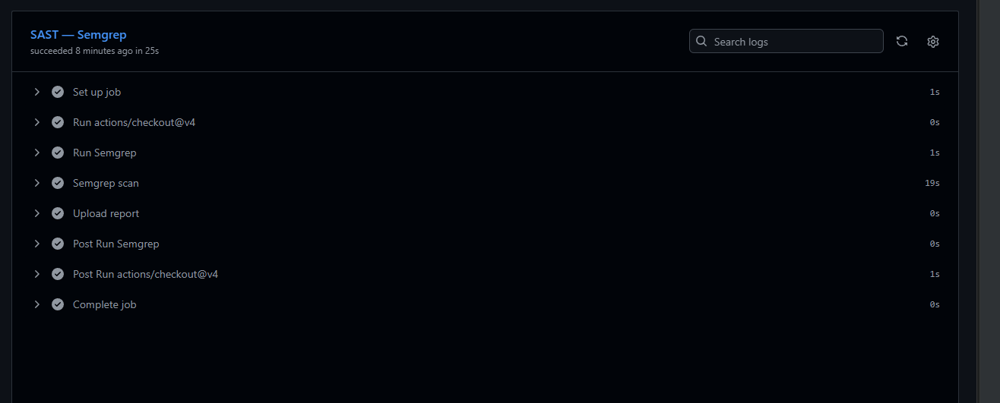
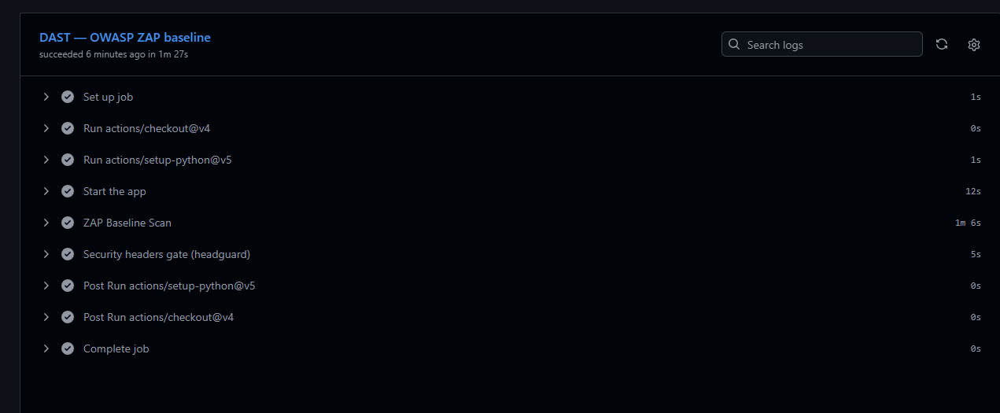

# The story: vulnerable → detected → remediated → verified

This file documents the journey of this repo — the part that actually matters.
All screenshots live in [`docs/`](docs/).

## 1 · The vulnerable app (initial main)

`app/app.py` shipped with three intentional vulnerabilities, each mapped to the
OWASP Top 10:

| # | Vulnerability | OWASP | Where | How to trigger it |
|---|---|---|---|---|
| 1 | Reflected XSS | A03 Injection | `/hello?name=` | `` |
| 2 | SQL Injection | A03 Injection | `/user?id=` | `1 OR 1=1` |
| 3 | Missing security headers | A05 Security Misconfiguration | every response | headguard scores **F** |

Each one is commented in the code with what makes it dangerous and what the fix is.

## 2 · Detection — the pipeline goes red

**DAST (ZAP baseline)** caught the missing headers at runtime — CSP, Permissions-Policy,
Sec-Fetch-Dest, and the versioned `Server` banner:

**headguard** graded the app **F** and blocked the merge (`exit 1`):

*(SAST/Semgrep flagged the string-concatenated SQL query and the unescaped HTML at
the source — report available as a workflow artifact.)*

What I found interesting here: the tools catch **different** things. SAST sees the
dangerous code patterns; DAST sees the actual runtime behavior. Neither alone is
enough — that's exactly why AppSec pipelines run both.

## 3 · Remediation (commit: `fix: remediate OWASP findings`)

The fixes I applied:

1. **XSS** → Jinja templates with autoescaping (`render_template_string` + `{{ name }}`).
2. **SQLi** → parameterized queries (`conn.execute("... WHERE id = ?", (uid,))`).
3. **Headers** → added `Content-Security-Policy`, `X-Frame-Options`,
   `X-Content-Type-Options`, `Referrer-Policy`, `Permissions-Policy`, `COOP` and `CORP`.
4. **Information disclosure** → replaced the versioned `Server` banner.

> **Why the gate is B and not A:** headguard scores **HSTS at 20 points**, and HSTS
> only makes sense over TLS. On plain `http://localhost` the maximum possible grade
> is therefore **B (80%)** — in production, behind a TLS-terminating proxy, the same
> code would gate at **A**. The workflow carries a comment explaining exactly this.

## 4 · Verification — the pipeline goes green

Same commit, same gates — now passing: **run #4 Success** ✅

| Gate | Result |
|---|---|
| SAST — Semgrep | ✅ 0 findings (25s) |
| DAST — ZAP baseline | ✅ pass (1m27s) |
| Headers gate — headguard | ✅ **F → B** |

## What this demonstrates

- **SAST catches bugs in code** before they ever run.
- **DAST catches bugs in behavior** that static analysis can't see (headers, runtime config).
- **The merge gate makes security a requirement** — vulnerable code literally cannot land.
- Remediation isn't "fixed and forgotten": the same pipeline that caught the bugs
  is the one that verifies the fix.
